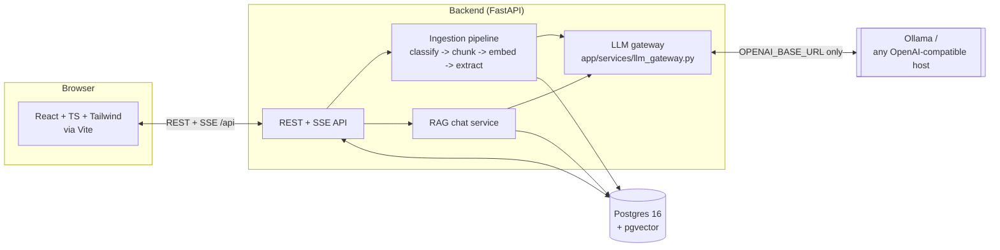

# Clinician Workstation

A clinical document intelligence platform: upload a patient's records, get an
auto-generated per-patient "wiki" (problem list, medications, allergies, labs,
timeline, care plan), chat with an LLM grounded only in that patient's own
records, and route every AI-generated update through a human curator before
it ever reaches the wiki. Built to replace/upgrade the `_Dashboard` prototype
this folder sits next to.

**Priority order this was built in, per spec:** Summary view → Chat → Curation
flow → everything else. All are done; see [Status & assumptions](#status--assumptions-made)
for the judgment calls made along the way.

## Contents

- [Architecture](#architecture)
- [Repo layout](#repo-layout)
- [Quickstart (Docker, recommended)](#quickstart-docker-recommended)
- [Manual setup (no Docker)](#manual-setup-no-docker)
- [Demo logins](#demo-logins)
- [Deployment targets](#deployment-targets)
- [The LLM gateway](#the-llm-gateway)
- [Model benchmark script](#model-benchmark-script)
- [Lab trends](#lab-trends)
- [Importing the real _Dashboard documents](#importing-the-real-_dashboard-documents)
- [Data model](#data-model)
- [Curation workflow](#curation-workflow)
- [Auth & roles](#auth--roles)
- [PHI / HIPAA notes](#phi--hipaa-notes)
- [Verification](#verification)
- [Status & assumptions made](#status--assumptions-made)

## Architecture



**The one hard rule this whole app is built around:** every LLM call, anywhere
in the backend, goes through `app/services/llm_gateway.py`, which reads only
`OPENAI_BASE_URL` + `*_MODEL` env vars and speaks the OpenAI-compatible
`/chat/completions` + `/embeddings` surface over plain `httpx`. No provider
SDK is imported anywhere else. That's what makes switching deployment targets
a config change, not a code change -- see [Deployment targets](#deployment-targets).

The gateway also has a full **mock mode** (`LLM_MODE=mock`, or automatic
fallback in `LLM_MODE=auto` when nothing answers at `OPENAI_BASE_URL`) with
deterministic rule-based stand-ins for chat, streaming, embeddings, and
extraction -- the entire app, including curation and RAG chat, works
end-to-end with zero LLM configured. That's how this was built and verified
in an environment with no GPU/Ollama available, and it's also just a good
demo mode.

## Repo layout

```
backend/
  app/
    api/            REST routers (auth, patients, documents, wiki, curation, chat, admin)
    models/         SQLAlchemy models (Postgres + pgvector)
    schemas/        Pydantic request/response models
    services/       llm_gateway, ingestion pipeline, rag, curation, classify, audit
    core/           security (JWT/bcrypt), request deps/RBAC
    alembic/        migrations
  scripts/          benchmark_models.py + fixtures + results
  seed/             synthetic demo patients + seed script
  data/uploads/     uploaded document files (gitignored contents)
frontend/
  src/
    pages/          one file per route (PatientSummaryPage, PatientChatPage, CurationDetailPage, ...)
    components/     Sidebar, AppShell, WikiSectionCard, DocumentTimeline, ui primitives, ...
    api/client.ts   typed fetch wrapper (auth refresh, SSE parsing, blob-URL file downloads)
    contexts/       Auth / Toast / ActivePatient React contexts
verify/             Playwright scripts used to smoke-test the running app end-to-end
docker-compose.yml  DEV / CLIENT ON-PREM stack: postgres + ollama + backend + frontend
```

## Quickstart (Docker, recommended)

Prerequisites: Docker + Docker Compose.

```bash
cp backend/.env.example backend/.env    # edit JWT_SECRET at minimum for anything beyond a laptop
docker compose up --build
```

First run only -- pull the models into Ollama's volume, then seed synthetic demo data:

```bash
docker compose exec ollama ollama pull qwen3:14b
docker compose exec ollama ollama pull qwen3:8b
docker compose exec ollama ollama pull nomic-embed-text
docker compose exec backend python -m seed.seed_data
```

Open http://localhost:8080. Without pulling any models, the app still runs
completely (mock mode kicks in automatically) -- pull them whenever you want
real model output instead of the mock stand-ins.

## Manual setup (no Docker)

Needs: Postgres 16+ with the `pgvector` extension available, Python 3.11+,
Node 20+, and (optionally) Ollama running locally.

```bash
# --- Backend ---
cd backend
python3 -m venv .venv && .venv/bin/pip install -r requirements.txt
cp .env.example .env   # edit DATABASE_URL to point at your Postgres
.venv/bin/alembic upgrade head
.venv/bin/python -m seed.seed_data
.venv/bin/uvicorn app.main:app --reload --port 8000

# --- Frontend (separate terminal) ---
cd frontend
npm install
npm run dev   # http://localhost:5173, proxies /api to :8000
```

If Ollama isn't running, `LLM_MODE=auto` (the default) falls back to mock
responses automatically -- you'll see an "LLM: mock" badge in the top bar
instead of an error.

## Demo logins

Seeded by `seed/seed_data.py`, password `DemoPass123!` for all three:

| Role      | Email                       |
|-----------|------------------------------|
| Physician | physician@democlinic.io      |
| Curator   | curator@democlinic.io        |
| Admin     | admin@democlinic.io          |

Three synthetic patients are seeded (Maria Alvarez, James Whitfield, Priya
Nair -- fictional MRNs `DEMO-100x`), run through the real ingestion pipeline.
James Whitfield is left fully curated so you can see a "clean" chart; the
other two are left with pending curation items so the queue isn't empty on
first login.

## Deployment targets

The **only** thing that changes between these three is environment variables
read by `backend/app/config.py` -- no code branches on "which deployment am
I", and no provider SDK is ever swapped in.

| | DEV | RAILWAY POC | CLIENT ON-PREM |
|---|---|---|---|
| Where it runs | Your machine, Docker Compose | Railway (2 services: backend, frontend) + Railway Postgres | Client's own network |
| Postgres | `postgres` compose service (pgvector image) | Railway Postgres add-on (`pgvector` must be enabled: `CREATE EXTENSION vector;`) | Client's own Postgres 16+, pgvector installed |
| `OPENAI_BASE_URL` | `http://ollama:11434/v1` (compose service) | A tunneled Ollama on your Mac Mini (Cloudflare Tunnel / ngrok), or any OpenAI-compatible open-weights host | `http://<onprem-host>:11434/v1` -- never a public internet host |
| Patient data | Synthetic seed data, or your own | **Synthetic only -- never real PHI** | Real patient data; PHI never leaves this network |
| `LLM_MODE` | `auto` | `auto` (demo should degrade gracefully if the tunnel drops) | `live` (an outage should be visible, not silently mocked) |

### Railway PoC setup

1. Create a Railway project. Add a **Postgres** plugin; once it's up, connect
   to it and run `CREATE EXTENSION IF NOT EXISTS vector;` once (Railway's
   Postgres image ships the extension but doesn't enable it by default).
2. Add a service from this repo with root directory `backend/` (Railway picks
   up `backend/railway.json` + `backend/Dockerfile` automatically). Set env
   vars: `DATABASE_URL` (from the Postgres plugin's connection string, but
   swap the driver prefix to `postgresql+psycopg2://`), `JWT_SECRET`,
   `OPENAI_BASE_URL` (your tunneled Ollama or hosted OpenAI-compatible
   endpoint), `CHAT_MODEL`/`EXTRACTION_MODEL`/`EMBEDDING_MODEL`, `LLM_MODE=auto`.
3. Add a second service with root directory `frontend/` (`frontend/railway.json`
   + `frontend/Dockerfile`). Set `BACKEND_INTERNAL_URL` to the backend
   service's Railway private-networking hostname, e.g.
   `http://backend.railway.internal:8000` (enable private networking between
   the two services in Railway's settings).
4. Run the seed script once against the deployed backend (`railway run --service backend python -m seed.seed_data`
   from the CLI, or a one-off Railway shell) -- **synthetic data only** on
   this target, always.

### Client on-prem setup

Run `docker-compose.yml` on the client's own hardware (bare metal or a VM on
their network), pointed at their own Ollama instance and their own Postgres
if they'd rather not run the compose Postgres. Set `LLM_MODE=live` once
Ollama is confirmed reachable, so a real outage surfaces as the explicit
model-unavailable state in the UI instead of quietly degrading to mock
answers -- that distinction matters clinically. No component in this stack
makes an outbound call to anything outside the network you deploy it in.

## The LLM gateway

`backend/app/services/llm_gateway.py`'s `LLMGateway` class is the single
place that talks to a model server. Everything else calls its methods:

- `chat()` / `chat_json()` -- non-streaming completions, with a mock fallback.
- `chat_stream()` -- SSE-style incremental chunks, used by `Ask`'s streaming UI.
- `embed()` -- embeddings for `DocumentChunk.embedding` (pgvector `VECTOR(768)`, HNSW index, cosine distance).
- `chat_with_meta()` -- like `chat()` but targets a *specific* model with no
  mock fallback and returns latency/token metadata; used only by
  `scripts/benchmark_models.py`.

Model routing (also just env vars, see `.env.example`):

| Role | Default model | Context cap |
|---|---|---|
| Chat / RAG answers | `qwen3:14b` | 12,000 tokens (8-16k guardrail) |
| Structured extraction | `qwen3:8b` | 12,000 tokens |
| Embeddings | `nomic-embed-text` (768-dim) — `bge-m3` (1024-dim) is a drop-in swap, just update `EMBEDDING_DIM` together with it |

Retry/backoff on transient connection errors (`tenacity`, 3 attempts,
exponential backoff), a 15s-cached reachability probe so `LLM_MODE=auto`
isn't re-probing on every request, and an explicit `LLMUnavailableError` in
`LLM_MODE=live` instead of a silent fallback.

## Model benchmark script

```bash
cd backend
.venv/bin/python -m scripts.benchmark_models \
  --chat-models qwen3:14b,llama3.1:8b-instruct \
  --extraction-models qwen3:8b,llama3.1:8b-instruct
```

Runs 10 synthetic chat questions and 10 synthetic extraction documents
(`scripts/bench_fixtures.py`) against each candidate model, reports avg
latency / tokens-per-second / an automatic keyword-coverage proxy score per
model, and writes full transcripts under `scripts/benchmark_results/` for a
human to spot-check before picking a default. See
`scripts/benchmark_results/RESULTS_TEMPLATE.md` for how to read a run (and
why the score is a proxy, not a verdict) -- needs a reachable Ollama with the
candidate models already pulled; `--dry-run` exercises the script's wiring
with mock responses when nothing is reachable.

## Lab trends

The Summary page shows a "Lab trends" panel -- a small chart per lab marker
(CA-125, CEA, Hemoglobin, WBC, Platelet, Creatinine, SGOT/AST, SGPT/ALT,
Total Bilirubin, CA19-9) with a rising/falling/stable badge and a link back
to the source document behind every point. It's computed on the fly
(`GET /patients/{id}/wiki/trends`, `app/services/trends.py`) from whichever
published `lab_highlights` facts carry structured `test`/`value`/`unit`
fields -- set at extraction time by both the mock extractor and the real LLM
prompt (`app/services/ingestion.py`'s `normalize_lab_marker` and
`EXTRACTION_SYSTEM_PROMPT`) whenever a fact is one specific numeric lab
result. A fact only feeds a trend once a curator has accepted/edited it into
the wiki -- an AI draft still sitting in the Curation Queue doesn't move the
chart.

This is a generic capability, not a per-patient one: any patient accumulates
a trend line for a marker the moment two of their documents report it,
because every document goes through the same extraction step. That's a
deliberate difference from the earlier single-patient dashboard prototype
(`_Dashboard/scripts/build_wiki_*.py`), which hand-transcribed one patient's
CA-125/CEA/etc. history into a hardcoded Python list with matplotlib charts
committed as static PNGs -- accurate for that one patient, but nothing else
in the practice got the same treatment. Re-ingesting the prototype's real
documents through this app's pipeline (see next section) reproduces the same
kind of trend chart for every patient in those records, generated the same
way a brand-new upload would be.

## Importing the real _Dashboard documents

`_Dashboard/data/manifest.json` + `_Dashboard/data/text/<patient>/*.txt` hold
the real OCR'd text and classification for the 335 documents across the 5
real patients in the earlier prototype (produced by
`_Dashboard/scripts/ingest.py`, the same classifier `app/services/classify.py`
was adapted from). `scripts/import_dashboard_documents.py` re-ingests that
real text through this app's actual pipeline -- classify → chunk → embed →
extract → curation queue -- exactly like a fresh upload, instead of trusting
the prototype's one-off hand-written wiki pages.

```bash
cd backend
.venv/bin/python -m scripts.import_dashboard_documents \
  --dashboard-dir "/Volumes/WD2TB/DrJ-CancerFiles/_Dashboard" \
  --confirm-local-phi-import
```

Run this only against your own local Postgres in the DEV or CLIENT ON-PREM
target -- **never** against the Railway PoC target, which must only ever
hold synthetic data. It's resumable (a small local checkpoint file next to
the manifest tracks what's already imported, so an interrupted run picks up
where it left off) and does not publish anything automatically -- every
imported document lands in the Curation Queue for a curator to review, same
as any other upload. Try `--dry-run` first (reports counts, writes nothing),
and `--patient "Alka Agarwal"` to import one patient at a time. Original
scanned files are copied alongside the OCR text when found (so "Open
original" works in Documents); if one can't be located, the document still
imports using its OCR'd text alone.

## Data model

`Patient` — `Document` (upload → classify → chunk → embed → extract →
curate, with an explicit `error` state) — `DocumentChunk` (text + `Vector(768)`
embedding, HNSW-indexed) — `WikiSection` (one row per patient per section
type; `content` is a JSONB array of facts, each with `text`, `confidence`,
`status` (reviewed/unreviewed), and a `sources` list pointing back to the
document/page it came from) — `WikiRevision` (full history on every publish)
— `Curation` (one per document pending review; `proposed_changes` is JSONB
keyed by section type) with per-section `CurationSectionDecision` rows
(accept/edit/reject + reviewer note) — `ChatSession`/`ChatMessage` (citations
stored per message) — `User`/role enum — `AuditLog` (every login, view, ask,
curation decision, and publish). Migrations: `backend/app/alembic/versions/`.

## Curation workflow

Every AI-extracted fact starts life attached to a `Curation` record, never
written straight to the wiki. A curator (or physician) opens the split-screen
view (`CurationDetailPage`): source document on the left with search
highlighting, proposed per-section diff cards on the right. Accept / Edit /
Reject each section (`J`/`K` to navigate sections, `A`/`E`/`R` to act), then
**Publish to Wiki** once every section has a decision -- that's the one
action that actually merges accepted/edited facts into the living wiki and
writes a `WikiRevision`. Rejected sections are recorded but never published.
The Curation Queue (`CurationQueuePage`) lists everything pending, filterable
by priority, with the same `J`/`K`/`Enter` keyboard flow.

## Auth & roles

JWT access + refresh tokens (`python-jose`), bcrypt password hashing.
Three roles: `physician`, `curator`, `admin` (RBAC enforced per-route via
`require_roles()` in `app/core/deps.py`). Every auth event and every
view/curation/chat action is written to `AuditLog`, visible under Admin →
Audit Log. `sso_enabled`/`mfa_enabled` config flags exist as documented
placeholders for a future SSO/MFA integration -- not implemented in this
pass (see [Status & assumptions](#status--assumptions-made)).

## PHI / HIPAA notes

This app was built and is intended to be run with these boundaries respected:

- **DEV** and **CLIENT ON-PREM** may hold real patient data; **RAILWAY POC**
  must never hold real patient data -- seed only synthetic patients there.
- All three targets keep PHI inside whatever network Postgres and the LLM
  gateway's target both live in -- the app itself makes no third-party network
  calls beyond `OPENAI_BASE_URL` and the database.
- Every view of a patient, document, or chat answer is audit-logged with
  actor, timestamp, resource, and IP (`AuditLog`).
- This build does not implement encryption-at-rest, BAA-covered infra, or a
  security review -- those are deployment/ops concerns for whoever operates
  the CLIENT target with real data, not something a codebase alone provides.
  Treat this as a strong starting point for a clinically-reviewed,
  compliance-reviewed deployment, not as a HIPAA-compliant system out of the box.

## Verification

`verify/screenshot.py` and `verify/screenshot2.py`/`screenshot3.py` are
Playwright scripts that log in, walk every major flow (patients → summary →
documents (incl. preview pane) → chat (incl. starter questions + citations) →
curation queue → curation detail → accept/edit/reject → publish → admin), and
assert zero browser console errors. Run them against a locally running dev
stack (`uvicorn` on :8000, `vite` on :4173/:5173) with
`.venv_playwright`'s Chromium or any local Playwright install:

```bash
python3 verify/screenshot.py
```

## Status & assumptions made

Built in priority order (Summary → Chat → Curation → everything else), all
eight requirement areas are implemented. Judgment calls made where the spec
was ambiguous, per the "choose the clinician-friendly option and note it"
instruction:

- **SSO/MFA**: config placeholders (`SSO_ENABLED`/`MFA_ENABLED`) and a users
  table shaped to support it later, but no actual SSO/MFA provider is wired
  up -- flagged as out of scope for a first pass rather than half-implemented.
- **Refresh tokens** are stateless JWTs with no server-side revocation list
  (documented in `app/core/security.py`) -- simplest correct thing for a
  first pass; a real deployment handling sensitive data long-term should add
  a revocation store.
- **Mock mode** was treated as a first-class feature, not just a fallback --
  every layer (chat, streaming, embeddings, extraction) has a genuinely
  functional deterministic stand-in, because the spec explicitly required
  the app to demo end-to-end with zero LLM configured.
- **Embedding quality benchmarking** isn't automated the way chat/extraction
  are (no cheap automatic proxy for embedding quality without a labeled
  retrieval set) -- documented in `RESULTS_TEMPLATE.md` with a manual
  comparison approach instead of a fabricated score.
- The existing `_Dashboard` prototype's rule-based document classifier and
  date-guesser were ported into `app/services/classify.py` rather than
  rewritten from scratch, since they already encoded real judgment calls
  about this clinic's document types.
- **Lab trends** ("similar trends and summary points" as the old per-patient
  wiki HTML pages, requested after the initial build) are computed
  generically rather than hand-transcribed per patient: `lab_highlights`
  facts optionally carry structured `test`/`value`/`unit`/`event_date`
  fields (populated by the mock extractor and requested of any real LLM via
  the extraction prompt), and `app/services/trends.py` aggregates whatever
  a curator has accepted for a patient into per-marker series with a
  direction classification. This means trend charts appear for any patient,
  any marker, the moment enough structured facts are curated -- nothing is
  wired to a specific patient or test name beyond the canonical alias table
  in `normalize_lab_marker`.
- **Importing the real `_Dashboard` documents** is a script
  (`scripts/import_dashboard_documents.py`), not a data migration baked
  into this repo: it re-ingests the OCR'd text already produced by the old
  prototype through this app's real pipeline (classify → chunk → embed →
  extract → curation queue) so the same clinicians can review and publish
  it here. It's meant to be run locally by whoever has the source files,
  against their own database -- no real patient data was ever fetched into,
  stored in, or committed to this codebase or the environment building it;
  the script was validated only against a synthetic fixture with fabricated
  patient/lab data. See "Importing the real `_Dashboard` documents" above
  for usage.
